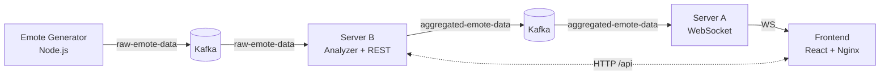

<div align="center">

# Emote System

Reacting in Real‑Time: Emotes and Kafka in Action

[]()
[]()
[]()
[]()
[]()
[]()

<br/>
<i>A distributed, event‑driven web app built for COMP.CS.510 (Spring 2025). It ingests viewer emotes, mines significant moments, and streams highlights to the UI in real‑time.</i>

</div>

---

### Quick links
- ↪ Architecture: high‑level diagram and flow
- ⚙️ Getting Started: one‑command Docker launch
- 🔌 API & Contracts: REST, WebSocket, Kafka
- 🧠 Features: real‑time, configurable analysis, animations
- 🛣️ Roadmap & Contributions

---

## Table of contents
- [Overview](#overview)
- [Architecture](#architecture)
- [Features](#features)
- [Screenshots](#screenshots)
- [Getting started](#getting-started)
- [Configuration](#configuration)
- [API & contracts](#api--contracts)
- [Project structure](#project-structure)
- [Roadmap](#roadmap)
- [Contributing](#contributing)
- [License](#license)
- [Acknowledgements](#acknowledgements)

## Overview
The system enables viewers of live streams to react to meaningful moments with emotes. Raw reactions are processed into “significant moments” and pushed to the frontend over WebSocket for a live experience.

## Architecture

### Components
- **Emote Generator**: produces random emote events every second (80% single, 20% bursts)
- **Server B (Analyzer + Settings API)**: consumes raw events, aggregates significant moments, exposes REST for settings
- **Server A (WebSocket gateway)**: consumes aggregated moments and broadcasts to the frontend via WebSocket
- **Frontend (React + Nginx)**: displays live moments, lets users tweak analyzer settings
- **Kafka**: message broker (KRaft, no Zookeeper)

### Data flow (mermaid)


### Topics
- `raw-emote-data`: generator → analyzer
- `aggregated-emote-data`: analyzer → WS gateway

## Features
- **Real‑time updates** over WebSocket
- **Configurable analysis** via REST API: interval, threshold, allowed emotes
- **Interactive UI** with floating animations on significant moments
- **Fully containerized** with Docker Compose

## Screenshots
Add your media to `frontend/public/` and reference here.
- Demo GIF (WebSocket updates + animations)
- Settings panel (interval, threshold, allowed emotes)

## Getting started
Prerequisites: Docker and Docker Compose

Start all services:
```bash
docker-compose up -d
```

Open the app:
```text
http://localhost:8080
```

Services and ports (local dev):
- Frontend (Nginx): `:8080`
- Server A (WebSocket): `:3002`
- Server B (REST API): `:3001`
- Kafka: internal at `kafka:9092`

Stop:
```bash
docker-compose down
```

## Configuration
Compose injects sensible defaults. Notable environment variables:
- Emote generator: `KAFKA_BROKER`, `KAFKA_TOPIC=raw-emote-data`
- Server B: `KAFKA_BROKER`, `KAFKA_TOPIC_IN=raw-emote-data`, `KAFKA_TOPIC_OUT=aggregated-emote-data`, `PORT=3001`
- Server A: `KAFKA_BROKER`, `KAFKA_TOPIC=aggregated-emote-data`, `PORT=3002`
- Frontend Nginx proxy (see `frontend/nginx.conf`): `/api` → Server B, `/ws` → Server A

Note: For demos, Server A/B ports are exposed. For a stricter setup, remove host ports and route everything via Nginx.

## API & contracts
### Server B – Settings API (REST)
- `GET /settings/interval` → `{ interval: number }`
- `PUT /settings/interval` with `{ interval: number }`
- `GET /settings/threshold` → `{ threshold: number }`
- `PUT /settings/threshold` with `{ threshold: number }`
- `GET /settings/allowed-emotes` → `{ allowedEmotes: string[] }`
- `PUT /settings/allowed-emotes` with `{ allowedEmotes: string[] }`

### Server A – WebSocket
Broadcasts messages:
```json
{
  "type": "significant-moments",
  "data": [
    { "emote": "🔥", "timestamp": "2025-05-01T10:20:30.000Z", "count": 42, "ratio": 0.72 }
  ]
}
```

### Kafka payloads
- Raw emote: `{ emote: string, timestamp: ISO8601 }`
- Aggregated moment: `{ emote: string, timestamp: ISO8601, count: number, ratio: number }`

## Project structure
```
./
├─ docker-compose.yml             # Kafka, generator, server-a, server-b, frontend
├─ emote-generator/               # Emote producer (Node.js + KafkaJS)
├─ server-a/                      # WebSocket broadcaster (Node.js)
├─ server-b/                      # Analyzer + Settings API (Node.js)
├─ frontend/                      # React app + Nginx
├─ documentation.md               # Course documentation & design notes
└─ quitters/                      # Course group variant (modular layout)
```

## Roadmap
- Persist settings and moments (DB/Redis)
- AuthN/Z for Settings API
- Richer analysis (adaptive thresholds, time windows)
- Observability (metrics/dashboards)

## Contributing
Issues and PRs are welcome. For larger changes, open an issue first to discuss direction.

## License
Educational license for COMP.CS.510. If you reuse, please credit the author(s).

## Acknowledgements
- Course brief: COMP.CS.510 Advanced Web Development – Back End (Spring 2025)
- Bitnami Kafka (KRaft) image
- KafkaJS – modern Kafka client for Node.js


