<div align="center">

<h1 align="center">🎭 Emote System 🎭</h1>

<p align="center">
  <strong>Reacting in Real‑Time: Emotes and Kafka in Action</strong>
  <br />
  <br />
  <i>A distributed, event‑driven web application that simulates and processes emote reactions in real‑time, built with Node.js, React, Kafka, and Docker.</i>
</p>

<p align="center">
    
    
</p>

<p align="center">
    
    
    
    
</p>

</div>

---

## Table of contents
- [Overview](#overview)
- [Architecture](#architecture)
- [Features](#features)
- [Screenshots](#screenshots)
- [Getting started](#getting-started)
- [Configuration](#configuration)
- [API & contracts](#api--contracts)
- [Project structure](#project-structure)
- [Roadmap](#roadmap)
- [Contributing](#contributing)
- [License](#license)
- [Acknowledgements](#acknowledgements)

## 📖 Overview

The system enables viewers of live streams to react to meaningful moments with emotes. Raw reactions are processed into “significant moments” and pushed to the frontend over WebSocket for a live experience.

## 🏗️ Architecture

The system is composed of five core components that work together to process and visualize emote data in real-time.

| Component                 | Technology                   | Description                                                                                                                              |
| :------------------------ | :--------------------------- | :--------------------------------------------------------------------------------------------------------------------------------------- |
| 🎭 **Emote Generator**    | `Node.js`, `KafkaJS`         | Simulates user activity by producing a continuous stream of emote events to a Kafka topic.                                               |
| 🧠 **Server B**           | `Node.js`, `Express`, `KafkaJS` | Consumes raw emote events, analyzes them to find "significant moments," and exposes a REST API for dynamic configuration.                  |
| 🔌 **Server A**           | `Node.js`, `ws`, `KafkaJS`   | Consumes significant moments from Kafka and broadcasts them to all connected frontend clients via WebSockets.                          |
| 🖥️ **Frontend**            | `React`, `Nginx`             | Visualizes significant moments and provides a UI to configure the analysis settings. Served by Nginx, which also acts as a reverse proxy. |
| 🔗 **Kafka**              | `KRaft mode`                 | The central message broker, decoupling services and enabling asynchronous, durable communication.                                        |

### Data Flow

The diagram below illustrates how data moves through the system, from generation to visualization.

```mermaid
flowchart LR
    subgraph "✨ Emote Generation"
        EG[("fa:fa-rocket<br/>Emote Generator")]
    end

    subgraph "🔄 Real-Time Pipeline"
        K[(fa:fa-server<br/>Kafka)]
        SB("fa:fa-cogs<br/>Server B<br/>Analyzer + API")
        SA("fa:fa-plug<br/>Server A<br/>WebSocket Gateway")
    end

    subgraph "👁️ User Interface"
        FE[("fa:fa-desktop<br/>Frontend")]
    end

    EG -->|raw-emote-data| K
    K -->|raw-emote-data| SB
    SB -->|aggregated-emote-data| K
    K -->|aggregated-emote-data| SA
    SA --o|WebSocket| FE
    FE -->|HTTP API| SB
```



### Kafka Topics
- `raw-emote-data`: Carries raw emote events from the Emote Generator to Server B. Each message represents a single emote reaction.
- `aggregated-emote-data`: Transports processed, significant moments from Server B to Server A. Each message contains a batch of moments that have met the defined analysis criteria.

## ✨ Features

-   **⚡ Real-Time Updates**: Significant moments are delivered to the frontend in real-time using WebSockets. Server A pushes moments as soon as they are processed, and the React frontend updates dynamically.

-   **🔧 Configurable Analysis**: The analysis logic is highly configurable via a REST API. Dynamically adjust the processing interval, significance threshold, and tracked emotes to tune the system's behavior on the fly.

-   **🎨 Interactive UI with Animations**: The React frontend provides a user-friendly interface for viewing moments and configuring settings. New moments trigger floating emote animations, enhancing the user experience.

-   **🐳 Fully Containerized**: The entire application is orchestrated with Docker Compose, enabling a consistent, one-command startup for all services, including the Kafka message broker.

## 📸 Screenshots

*Add your media to `frontend/public/` and reference it here.*

-   Demo GIF (WebSocket updates + animations)
-   Settings panel (interval, threshold, allowed emotes)

## 🚀 Getting Started

This project is designed to be run with Docker Compose for a quick and easy setup.

### Prerequisites

-   [Docker](https://www.docker.com/get-started) & [Docker Compose](https://docs.docker.com/compose/install/)
-   [Node.js](https://nodejs.org/en/) (v18+) and npm (for local development)

### Docker Compose (Recommended)

This is the simplest way to launch the entire application stack.

1.  **Launch all services:**
    ```bash
    docker-compose up -d
    ```

2.  **Access the application:**
    Open your browser and navigate to `http://localhost:8080`.

3.  **Monitor logs:**
    To view the logs for all services in real-time, run:
    ```bash
    docker-compose logs -f
    ```
    Or, for a specific service (e.g., `server-b`):
    ```bash
    docker-compose logs -f server-b
    ```

4.  **Shut down the system:**
    ```bash
    docker-compose down
    ```

<details>
<summary>💻 Local Development (Manual Setup)</summary>

If you prefer to run the services manually without Docker:

1.  **Start Kafka:**
    You still need Kafka. The easiest way is to start it via Docker Compose:
    ```bash
    docker-compose up -d kafka
    ```

2.  **Run Each Service:**
    For each service (`emote-generator`, `server-a`, `server-b`):
    -   Navigate to the service directory (e.g., `cd server-b`).
    -   Install dependencies: `npm install`.
    -   Set the required environment variables (see [Configuration](#-configuration)).
    -   Start the service: `npm start`.

    **Example for Server B:**
    ```bash
    cd server-b
    npm install
    export KAFKA_BROKER=localhost:9092
    export KAFKA_TOPIC_IN=raw-emote-data
    export KAFKA_TOPIC_OUT=aggregated-emote-data
    export PORT=3001
    npm start
    ```

3.  **Run the Frontend:**
    The React development server can be started for a better development experience:
    ```bash
    cd frontend
    npm install
    npm start
    ```
    The app will be available at `http://localhost:3000`. The API and WebSocket URLs in `src/App.js` are pre-configured for this setup.

</details>

<details id="configuration">
<summary>⚙️ Configuration</summary>

The system is configured using environment variables, which are defined in `docker-compose.yml` for containerized deployment and can be set in the shell for local development.

### Environment Variables

| Service          | Variable          | Description                                  | Default Value        |
| :--------------- | :---------------- | :------------------------------------------- | :------------------- |
| **Emote Gen**    | `KAFKA_BROKER`    | Address of the Kafka broker                  | `kafka:9092`         |
|                  | `KAFKA_TOPIC`     | Topic for raw emote data                     | `raw-emote-data`     |
| **Server B**     | `KAFKA_BROKER`    | Address of the Kafka broker                  | `kafka:9092`         |
|                  | `KAFKA_TOPIC_IN`  | Topic for consuming raw emotes               | `raw-emote-data`     |
|                  | `KAFKA_TOPIC_OUT` | Topic for publishing aggregated emotes       | `aggregated-emote-data` |
|                  | `PORT`            | Port for the REST API server                 | `3001`               |
| **Server A**     | `KAFKA_BROKER`    | Address of the Kafka broker                  | `kafka:9092`         |
|                  | `KAFKA_TOPIC`     | Topic for consuming aggregated data          | `aggregated-emote-data` |
|                  | `PORT`            | Port for the WebSocket server                | `3002`               |
| **Frontend**     | `WEBSOCKET_URL`   | URL for the WebSocket server (for Nginx)     | `ws://localhost:3002` |
|                  | `API_URL`         | URL for the REST API (for Nginx)             | `http://localhost:3001`|

### Customization

To customize the configuration for Docker Compose, you can create a `.env` file in the root of the project and override the default values. For example, to change the port for the frontend:

```env
# .env file
FRONTEND_PORT=8081
```

Then, modify `docker-compose.yml` to use this variable:
```yaml
services:
  frontend:
    ports:
      - "${FRONTEND_PORT:-8080}:80"
```
This will expose the frontend on port `8081`, or `8080` if the variable is not set.

</details>

<details id="api--contracts">
<summary>🔌 API & Contracts</summary>

This section details the data contracts for the REST API, WebSocket connections, and Kafka topics.

### Server B – Settings API (REST)

Server B exposes a REST API for managing the analysis settings.

**Endpoints:**

-   `GET /settings/interval`: Retrieves the current analysis interval.
-   `PUT /settings/interval`: Updates the analysis interval.
-   `GET /settings/threshold`: Retrieves the current significance threshold.
-   `PUT /settings/threshold`: Updates the significance threshold.
-   `GET /settings/allowed-emotes`: Retrieves the list of emotes being tracked.
-   `PUT /settings/allowed-emotes`: Updates the list of tracked emotes.

*For detailed request/response payloads, see the source code in `server-b/index.js`.*

### Server A – WebSocket

Server A broadcasts messages to all connected frontend clients.

-   **Connection**: On success, the server sends a `{ "type": "connection", ... }` message.
-   **Broadcasts**: Significant moments are sent as `{ "type": "significant-moments", "data": [...] }` messages.

### Kafka Payloads

-   **`raw-emote-data`**: Contains individual emote events as JSON objects: `{ "emote": "👍", "timestamp": "..." }`.
-   **`aggregated-emote-data`**: Contains an array of significant moments identified during an analysis window.

</details>

<details id="project-structure">
<summary>📁 Project Structure</summary>

The repository is organized into directories by service.

```
./
├── docker-compose.yml      # Defines and configures all services.
├── emote-generator/        # Service to simulate and generate emote data.
├── server-a/               # WebSocket gateway service.
├── server-b/               # Analysis and settings API service.
├── frontend/               # React frontend application.
├── documentation.md        # Course-specific documentation and design notes.
└── README.md               # This file.
```

</details>

## 🗺️ Roadmap

-   [ ] **Persist Settings & Moments**: Integrate a database (e.g., Redis or PostgreSQL) to store configuration and significant moments.
-   [ ] **Authentication & Authorization**: Secure the settings API endpoints.
-   [ ] **Richer Analysis**: Implement more sophisticated analysis, such as adaptive thresholds or time-decaying windows.
-   [ ] **Observability**: Add structured logging, metrics, and dashboards (e.g., using Prometheus and Grafana).

## 🤝 Contributing

Issues and pull requests are welcome! For major changes, please open an issue first to discuss what you would like to change.

## 📜 License

This project is licensed under the **Educational License**. See the `LICENSE` file for details. If you reuse any part of this project, please provide credit.

## 🙏 Acknowledgements

-   **Course**: COMP.CS.510 Advanced Web Development – Back End (Spring 2025)
-   **Inspiration**: The many real-time data processing pipelines that power modern web applications.
-   **Key Libraries**: A special thanks to the maintainers of `KafkaJS`, `Express`, and `React`.


