# 📚 Emote System Documentation

## 🏗️ Architecture Overview

This comprehensive documentation describes the architecture and implementation of the **Emote System**, a distributed, event-driven application that simulates real-time viewer reactions to live content. The system demonstrates modern web development practices including microservices architecture, real-time communication, and event-driven data processing.

### 🔧 System Components

The emote system is built as a collection of microservices, each with specific responsibilities:

| Component | Purpose | Technology | Port |
|-----------|---------|------------|------|
| **🎲 Emote Generator** | Simulates realistic emote data generation with burst patterns | Node.js + KafkaJS | Internal |
| **🧠 Server B** | Processes raw data, identifies significant moments, provides REST API | Node.js + Express + KafkaJS | 3001 |
| **📡 Server A** | WebSocket gateway for real-time client communication | Node.js + WebSocket + KafkaJS | 3002 |
| **🎨 Frontend** | React dashboard with real-time updates and configuration panel | React + Nginx | 8080 |
| **📨 Kafka** | Message broker for reliable inter-service communication | Apache Kafka (KRaft) | 9092 |

### 🛠️ Technology Stack

| Layer | Technology | Purpose |
|-------|------------|---------|
| **Backend Services** | Node.js + Express | Lightweight, event-driven server framework |
| **Frontend** | React 18 | Modern UI with hooks and real-time state management |
| **Message Broker** | Apache Kafka (KRaft) | Reliable, distributed event streaming |
| **Containerization** | Docker + Docker Compose | Consistent deployment and orchestration |
| **Reverse Proxy** | Nginx | Static file serving and API routing |
| **Real-time Communication** | WebSocket | Low-latency bidirectional communication |

### 🔄 Data Flow Architecture

```mermaid
flowchart LR
    EG[🎲 Emote Generator] -->|raw-emote-data| K1[(📨 Kafka)]
    K1 -->|raw-emote-data| SB[🧠 Server B<br/>Analytics Engine]
    SB -->|aggregated-emote-data| K2[(📨 Kafka)]
    K2 -->|aggregated-emote-data| SA[📡 Server A<br/>WebSocket Gateway]
    SA -->|WebSocket| FE[🎨 Frontend<br/>React Dashboard]
    FE <-.->|REST API| SB
```



**Step-by-step data flow:**

1. **🎲 Data Generation**: Emote Generator creates realistic emote patterns (80% single, 20% bursts)
2. **📨 Message Streaming**: Raw emote data flows through Kafka to ensure reliable delivery
3. **🧠 Real-time Analysis**: Server B processes batches of emotes, identifies significant moments based on configurable thresholds
4. **📡 Live Broadcasting**: Server A consumes processed data and broadcasts to connected clients via WebSocket
5. **🎨 Interactive Dashboard**: Frontend displays significant moments with animations and provides configuration controls

## How to Run the System

### Prerequisites

- Docker and Docker Compose installed

### Steps to Run

1. Clone the repository
2. Navigate to the project directory
3. Run the following command to start all services:

```bash
docker-compose up -d
```

4. Access the frontend at http://localhost:8080

### Stopping the System

To stop all services, run:

```bash
docker-compose down
```

## Component Details

### Emote Generator

The Emote Generator produces random emote data with the following characteristics:
- Generates a new emote every second
- 80% chance for a single emote
- 20% chance for a burst of multiple (same) emotes
- Each emote includes a timestamp

### Server B

Server B is responsible for:
- Consuming raw emote data from Kafka
- Analyzing the data to identify significant moments
- Sending significant moments to Kafka
- Providing a REST API for settings management

#### REST API Endpoints

- `GET /settings/interval`: Get the current interval setting
- `PUT /settings/interval`: Update the interval setting
- `GET /settings/threshold`: Get the current threshold setting
- `PUT /settings/threshold`: Update the threshold setting
- `GET /settings/allowed-emotes`: Get the current allowed emotes
- `PUT /settings/allowed-emotes`: Update the allowed emotes

### Server A

Server A is responsible for:
- Consuming aggregated emote data from Kafka
- Sending the data to the frontend via WebSocket

### Frontend

The frontend provides:
- Real-time display of significant moments
- Settings management interface
- Animations for significant moments

## Design Patterns

### Publish-Subscribe Pattern

The system uses the publish-subscribe pattern through Kafka for asynchronous communication between components. This allows for loose coupling and scalability.

### MVC Pattern

The frontend follows the Model-View-Controller pattern with React components for the view, state management for the model, and event handlers for the controller.

### RESTful API

Server B provides a RESTful API for settings management, following REST principles for resource manipulation.

## Deployment

The system is containerized using Docker and orchestrated with Docker Compose. Each component runs in its own container, and they communicate through a shared Docker network.

## Future Improvements

- Add authentication for the settings API
- Implement persistent storage for settings and significant moments
- Add more sophisticated analysis algorithms for identifying significant moments
- Enhance the frontend with more interactive features
