# System Design Interview Questions & Answers
## Based on the Emote System Project

This document contains comprehensive system design interview questions and detailed answers based on the real-world emote-system project - a distributed, event-driven application for real-time emote analysis and streaming.

---

## Table of Contents
1. [High-Level System Design](#1-high-level-system-design)
2. [Scalability & Performance](#2-scalability--performance)
3. [Data Flow & Architecture](#3-data-flow--architecture)
4. [Technology Choices](#4-technology-choices)
5. [Real-time Processing](#5-real-time-processing)
6. [Error Handling & Resilience](#6-error-handling--resilience)
7. [Monitoring & Observability](#7-monitoring--observability)
8. [Security & Authentication](#8-security--authentication)
9. [Deployment & DevOps](#9-deployment--devops)
10. [Advanced Topics](#10-advanced-topics)

---

## 1. High-Level System Design

### Q1.1: Design a real-time emote analysis system for live streaming platforms

**Context**: You need to build a system that allows viewers to react to live streams with emotes, analyzes these reactions in real-time to identify significant moments, and streams highlights back to viewers.

**Answer**:

**System Overview**:
The emote system is a distributed, event-driven architecture that processes real-time emote data to identify and broadcast significant moments to viewers.

**Core Components**:

1. **Emote Generator** (Data Producer)
   - Simulates viewer reactions by generating random emote events
   - Produces 80% single emotes, 20% burst emotes (3-10 emotes)
   - Sends data to Kafka topic `raw-emote-data`

2. **Server B** (Analyzer + Settings API)
   - Consumes raw emote data from Kafka
   - Implements configurable analysis algorithms
   - Aggregates emotes by minute-level timestamps
   - Identifies significant moments based on threshold ratios
   - Provides REST API for settings management
   - Publishes results to `aggregated-emote-data` topic

3. **Server A** (WebSocket Gateway)
   - Consumes aggregated significant moments
   - Maintains WebSocket connections with frontend clients
   - Broadcasts real-time updates to connected viewers

4. **Frontend** (React + Nginx)
   - Displays significant moments in real-time
   - Provides settings management interface
   - Handles emote animations and user interactions

5. **Kafka** (Message Broker)
   - KRaft mode (no Zookeeper dependency)
   - Handles asynchronous communication between services
   - Ensures message durability and ordering

**Data Flow**:
```
Emote Generator → Kafka (raw-emote-data) → Server B → Kafka (aggregated-emote-data) → Server A → WebSocket → Frontend
```

**System Architecture Diagram**:


**Key Design Decisions**:
- **Event-driven architecture**: Enables loose coupling and scalability
- **Microservices separation**: Each service has a single responsibility
- **Kafka for messaging**: Provides durability, ordering, and replay capabilities
- **WebSocket for real-time**: Low-latency bidirectional communication
- **Configurable analysis**: Runtime adjustment of analysis parameters

---

### Q1.2: How would you handle the system if it needed to support 1 million concurrent viewers?

**Answer**:

**Scaling Strategy**:

1. **Horizontal Scaling**:
   - **Emote Generator**: Multiple instances with different emote pools
   - **Server B**: Scale based on message processing capacity
   - **Server A**: Multiple WebSocket servers behind load balancer
   - **Kafka**: Cluster with multiple brokers and partitions

2. **Kafka Optimization**:
   - Increase partition count for `raw-emote-data` topic (e.g., 100+ partitions)
   - Implement consumer groups for parallel processing
   - Use Kafka Streams for real-time aggregation
   - Configure appropriate retention policies

3. **WebSocket Scaling**:
   - Use Redis for WebSocket session management
   - Implement sticky sessions or session affinity
   - Consider WebSocket clustering solutions
   - Use CDN for static assets

4. **Database Considerations**:
   - Add Redis for caching settings and recent moments
   - Use PostgreSQL for persistent storage
   - Implement read replicas for analytics queries

5. **Infrastructure**:
   - Container orchestration with Kubernetes
   - Auto-scaling based on CPU/memory/connection metrics
   - Load balancers with health checks
   - Geographic distribution for global users

**Scaled Architecture Diagram**:


---

## 2. Scalability & Performance

### Q2.1: How would you optimize the system for high throughput and low latency?

**Answer**:

**Performance Optimizations**:

1. **Kafka Tuning**:
   ```yaml
   # Kafka configuration optimizations
   num.network.threads: 8
   num.io.threads: 16
   socket.send.buffer.bytes: 102400
   socket.receive.buffer.bytes: 102400
   socket.request.max.bytes: 104857600
   log.retention.hours: 24
   log.segment.bytes: 1073741824
   ```

2. **Consumer Optimization**:
   - Batch processing for better throughput
   - Async processing with worker pools
   - Connection pooling for database operations
   - Memory-efficient data structures

3. **WebSocket Optimization**:
   - Binary message format for reduced payload
   - Message compression (gzip/deflate)
   - Connection pooling and reuse
   - Efficient serialization (Protocol Buffers)

4. **Caching Strategy**:
   - Redis for hot data (recent moments, settings)
   - In-memory caching for frequently accessed data
   - CDN for static assets
   - Application-level caching

5. **Database Optimization**:
   - Indexing on timestamp and emote columns
   - Partitioning by time ranges
   - Read replicas for analytics
   - Connection pooling

**Latency Reduction**:
- Edge computing for WebSocket connections
- Pre-computed aggregations
- Asynchronous processing pipelines
- Optimized serialization formats

---

### Q2.2: How would you handle data consistency in a distributed system with multiple analyzers?

**Answer**:

**Consistency Strategies**:

1. **Event Sourcing**:
   - Store all emote events as immutable log
   - Replay events for consistent state reconstruction
   - Use Kafka as event store with proper partitioning

2. **Idempotent Processing**:
   - Include unique message IDs in Kafka messages
   - Implement idempotent consumers
   - Use idempotency keys for API operations

3. **Distributed Coordination**:
   - Use Kafka's partition assignment for consistent processing
   - Implement leader election for critical operations
   - Use distributed locks for shared resources

4. **Eventual Consistency**:
   - Accept eventual consistency for non-critical data
   - Use conflict resolution strategies
   - Implement compensation patterns for failures

5. **Monitoring & Validation**:
   - Implement data validation at each stage
   - Use checksums for data integrity
   - Monitor for duplicate processing
   - Alert on consistency violations

---

## 3. Data Flow & Architecture

### Q3.1: Explain the data flow and message formats in the emote system

**Answer**:

**Data Flow Architecture**:

1. **Raw Emote Data** (Kafka Topic: `raw-emote-data`):
   ```json
   {
     "emote": "🔥",
     "timestamp": "2025-01-15T10:20:30.000Z"
   }
   ```

2. **Aggregated Emote Data** (Kafka Topic: `aggregated-emote-data`):
   ```json
   [
     {
       "emote": "🔥",
       "timestamp": "2025-01-15T10:20:00.000Z",
       "count": 42,
       "total": 58,
       "ratio": 0.72
     }
   ]
   ```

3. **WebSocket Messages**:
   ```json
   {
     "type": "significant-moments",
     "data": [
       {
         "emote": "🔥",
         "timestamp": "2025-01-15T10:20:00.000Z",
         "count": 42,
         "ratio": 0.72
       }
     ]
   }
   ```

**Processing Pipeline**:

1. **Data Ingestion**:
   - Emote Generator produces events every second
   - Events sent to Kafka with proper partitioning
   - Schema validation at producer level

2. **Real-time Analysis**:
   - Server B consumes in batches (configurable interval)
   - Aggregates by minute-level timestamps
   - Applies configurable thresholds
   - Filters by allowed emotes

3. **Significance Detection**:
   - Calculates emote ratios per time window
   - Compares against threshold (default: 0.3)
   - Identifies moments exceeding threshold

4. **Real-time Broadcasting**:
   - Server A consumes significant moments
   - Broadcasts to all connected WebSocket clients
   - Handles client connection management

**Message Partitioning Strategy**:
- Partition by timestamp for temporal locality
- Ensure ordered processing within time windows
- Balance load across multiple partitions

**Data Flow Diagram**:

```mermaid
sequenceDiagram
    participant EG as Emote Generator
    participant K1 as Kafka (raw-emote-data)
    participant SB as Server B (Analyzer)
    participant K2 as Kafka (aggregated-emote-data)
    participant SA as Server A (WebSocket)
    participant FE as Frontend
    participant WS as WebSocket Clients
    
    Note over EG,WS: Real-time Emote Processing Flow
    
    loop Every Second
        EG->>K1: Send raw emote data<br/>{emote: "🔥", timestamp: "..."}
    end
    
    loop Batch Processing
        K1->>SB: Consume raw emotes
        SB->>SB: Aggregate by time window
        SB->>SB: Calculate significance ratios
        alt Significant moment detected
            SB->>K2: Send significant moments<br/>{emote: "🔥", count: 42, ratio: 0.72}
        end
    end
    
    K2->>SA: Consume significant moments
    SA->>WS: Broadcast via WebSocket<br/>{type: "significant-moments", data: [...]}
    
    Note over FE,SB: Settings Management
    FE->>SB: GET/PUT /settings/interval
    FE->>SB: GET/PUT /settings/threshold
    FE->>SB: GET/PUT /settings/allowed-emotes
    SB-->>FE: Return current settings
```


---

### Q3.2: How would you modify the system to support multiple streamers simultaneously?

**Answer**:

**Multi-Streamer Architecture**:

1. **Topic Partitioning by Streamer**:
   ```yaml
   # Kafka topics per streamer
   raw-emote-data-streamer-{id}
   aggregated-emote-data-streamer-{id}
   ```

2. **Streamer Context in Messages**:
   ```json
   {
     "streamerId": "streamer-123",
     "emote": "🔥",
     "timestamp": "2025-01-15T10:20:30.000Z"
   }
   ```

3. **Service Scaling**:
   - **Server B**: Multiple instances with streamer-specific consumers
   - **Server A**: Streamer-aware WebSocket routing
   - **Frontend**: Multi-streamer dashboard

4. **Data Isolation**:
   - Separate Kafka topics per streamer
   - Streamer-specific settings and configurations
   - Isolated analysis pipelines

5. **Load Balancing**:
   - Streamer-based routing in load balancers
   - Dynamic scaling based on streamer popularity
   - Resource allocation per streamer tier

6. **Cross-Streamer Features**:
   - Global trending moments across all streamers
   - Cross-streamer emote analytics
   - Unified dashboard for platform admins

---

## 4. Technology Choices

### Q4.1: Why did you choose Kafka over other message brokers like RabbitMQ or Redis Pub/Sub?

**Answer**:

**Kafka Advantages**:

1. **Durability & Persistence**:
   - Messages persisted to disk with configurable retention
   - Survives broker failures and restarts
   - Enables replay of historical data

2. **High Throughput**:
   - Optimized for high-volume, low-latency scenarios
   - Batch processing capabilities
   - Efficient disk I/O patterns

3. **Scalability**:
   - Horizontal scaling through partitioning
   - Distributed architecture
   - Handles millions of messages per second

4. **Ordering Guarantees**:
   - Message ordering within partitions
   - Critical for time-series emote data
   - Enables consistent analysis results

5. **Consumer Groups**:
   - Parallel processing with load balancing
   - Automatic failover and rebalancing
   - Multiple consumer types (real-time, batch, analytics)

**Comparison with Alternatives**:

**RabbitMQ**:
- ❌ Lower throughput for high-volume scenarios
- ❌ More complex clustering setup
- ✅ Better for complex routing patterns
- ✅ Built-in message acknowledgments

**Redis Pub/Sub**:
- ❌ No message persistence
- ❌ No consumer groups
- ❌ Memory-based (limited by RAM)
- ✅ Lower latency for simple pub/sub

**Kafka Streams Benefits**:
- Real-time stream processing
- Stateful operations (aggregations, joins)
- Exactly-once processing semantics
- Integration with Kafka ecosystem

---

### Q4.2: Why use WebSocket instead of Server-Sent Events (SSE) or HTTP polling?

**Answer**:

**WebSocket Advantages**:

1. **Bidirectional Communication**:
   - Client can send settings updates
   - Server can push real-time moments
   - Enables interactive features

2. **Lower Latency**:
   - No HTTP overhead after handshake
   - Persistent connection
   - Immediate message delivery

3. **Efficient Resource Usage**:
   - Single connection per client
   - No repeated HTTP headers
   - Reduced server load

**Comparison with Alternatives**:

**Server-Sent Events (SSE)**:
- ✅ Simpler implementation
- ✅ Automatic reconnection
- ❌ Unidirectional (server → client only)
- ❌ Limited browser connection limits

**HTTP Polling**:
- ✅ Simple to implement
- ✅ Works through firewalls/proxies
- ❌ Higher latency and resource usage
- ❌ Inefficient for real-time updates

**WebSocket Implementation Considerations**:
```javascript
// Connection management
const wss = new WebSocket.Server({ server });

// Heartbeat for connection health
setInterval(() => {
  clients.forEach(client => {
    if (client.readyState === WebSocket.OPEN) {
      client.ping();
    }
  });
}, 30000);

// Graceful reconnection
ws.on('close', () => {
  setTimeout(connectWebSocket, 3000);
});
```

---

## 5. Real-time Processing

### Q5.1: How does the system ensure real-time processing while maintaining accuracy?

**Answer**:

**Real-time Processing Strategy**:

1. **Streaming Architecture**:
   - Continuous data ingestion (1-second intervals)
   - Micro-batch processing (configurable intervals)
   - Pipeline parallelism for different processing stages

2. **Time Window Management**:
   ```javascript
   // Minute-level aggregation
   const minuteTimestamp = new Date(
     date.getFullYear(),
     date.getMonth(),
     date.getDate(),
     date.getHours(),
     date.getMinutes()
   ).toISOString();
   ```

3. **Configurable Analysis Parameters**:
   - **Interval**: Number of messages before analysis (default: 30)
   - **Threshold**: Significance ratio (default: 0.3)
   - **Allowed Emotes**: Filter for specific emotes

4. **Latency Optimization**:
   - In-memory aggregation for speed
   - Asynchronous processing pipelines
   - Direct WebSocket broadcasting
   - Minimal serialization overhead

5. **Accuracy Measures**:
   - Time-based aggregation windows
   - Statistical significance thresholds
   - Configurable analysis parameters
   - Real-time validation of results

**Trade-offs**:
- **Latency vs Accuracy**: Shorter intervals = lower latency but potentially less accurate
- **Memory vs Processing**: In-memory aggregation vs disk-based processing
- **Real-time vs Batch**: Streaming vs periodic batch processing

---

### Q5.2: How would you handle backpressure in the real-time processing pipeline?

**Answer**:

**Backpressure Handling Strategies**:

1. **Kafka Consumer Configuration**:
   ```javascript
   const consumer = kafka.consumer({
     groupId: 'server-b-group',
     maxBytes: 1048576, // 1MB
     maxWaitTimeInMs: 5000,
     sessionTimeout: 30000,
     heartbeatInterval: 3000
   });
   ```

2. **Processing Rate Limiting**:
   - Implement token bucket algorithm
   - Dynamic rate adjustment based on system load
   - Circuit breaker pattern for downstream services

3. **Memory Management**:
   - Bounded message queues
   - Automatic cleanup of old data
   - Memory pressure monitoring

4. **Graceful Degradation**:
   - Skip non-critical processing during high load
   - Reduce analysis frequency
   - Prioritize recent data over historical

5. **Monitoring & Alerting**:
   - Track processing lag
   - Monitor memory usage
   - Alert on backpressure conditions

**Implementation Example**:
```javascript
class BackpressureManager {
  constructor(maxQueueSize = 1000) {
    this.queue = [];
    this.maxQueueSize = maxQueueSize;
    this.processingRate = 100; // messages per second
  }

  async processMessage(message) {
    if (this.queue.length >= this.maxQueueSize) {
      // Drop oldest messages
      this.queue.shift();
    }
    
    this.queue.push(message);
    
    // Adjust processing rate based on queue size
    if (this.queue.length > this.maxQueueSize * 0.8) {
      this.processingRate = Math.max(50, this.processingRate * 0.8);
    }
  }
}
```

---

## 6. Error Handling & Resilience

### Q6.1: How would you handle failures in the distributed system?

**Answer**:

**Failure Handling Strategies**:

1. **Service-Level Resilience**:
   ```javascript
   // Graceful shutdown handling
   const shutdown = async () => {
     await consumer.disconnect();
     await producer.disconnect();
     wss.clients.forEach(client => client.close());
     server.close(() => process.exit(0));
   };
   
   process.on('SIGINT', shutdown);
   process.on('SIGTERM', shutdown);
   ```

2. **Kafka Resilience**:
   - **Producer**: Retry logic with exponential backoff
   - **Consumer**: Automatic rebalancing on failures
   - **Broker**: Replication factor for fault tolerance

3. **WebSocket Resilience**:
   - Automatic reconnection with exponential backoff
   - Connection health monitoring
   - Graceful degradation on connection loss

4. **Data Consistency**:
   - Idempotent message processing
   - Duplicate detection and handling
   - Transactional message publishing

5. **Circuit Breaker Pattern**:
   ```javascript
   class CircuitBreaker {
     constructor(threshold = 5, timeout = 60000) {
       this.failureCount = 0;
       this.threshold = threshold;
       this.timeout = timeout;
       this.state = 'CLOSED'; // CLOSED, OPEN, HALF_OPEN
     }
     
     async execute(operation) {
       if (this.state === 'OPEN') {
         throw new Error('Circuit breaker is OPEN');
       }
       
       try {
         const result = await operation();
         this.onSuccess();
         return result;
       } catch (error) {
         this.onFailure();
         throw error;
       }
     }
   }
   ```

6. **Monitoring & Recovery**:
   - Health check endpoints
   - Automatic service restart
   - Dead letter queues for failed messages
   - Alerting on critical failures

---

### Q6.2: How would you ensure data durability and prevent data loss?

**Answer**:

**Data Durability Strategies**:

1. **Kafka Configuration**:
   ```yaml
   # Producer durability settings
   acks: all                    # Wait for all replicas
   retries: 2147483647         # Infinite retries
   max.in.flight.requests.per.connection: 1
   enable.idempotence: true
   
   # Topic durability settings
   replication.factor: 3
   min.insync.replicas: 2
   unclean.leader.election.enable: false
   ```

2. **Message Acknowledgment**:
   - Producer waits for acknowledgment from all replicas
   - Consumer commits offsets only after successful processing
   - Idempotent producers prevent duplicate messages

3. **Backup & Recovery**:
   - Regular Kafka topic backups
   - Cross-region replication for disaster recovery
   - Point-in-time recovery capabilities

4. **Data Validation**:
   - Schema validation at producer level
   - Checksum validation for message integrity
   - End-to-end data validation

5. **Monitoring**:
   - Track message loss rates
   - Monitor replication lag
   - Alert on data inconsistency

**Implementation Example**:
```javascript
// Durable producer configuration
const producer = kafka.producer({
  maxInFlightRequests: 1,
  idempotent: true,
  transactionTimeout: 30000,
  retry: {
    initialRetryTime: 100,
    retries: 8
  }
});

// Durable consumer configuration
const consumer = kafka.consumer({
  groupId: 'server-b-group',
  sessionTimeout: 30000,
  heartbeatInterval: 3000,
  maxWaitTimeInMs: 5000
});
```

---

## 7. Monitoring & Observability

### Q7.1: How would you implement comprehensive monitoring for this system?

**Answer**:

**Monitoring Strategy**:

1. **Application Metrics**:
   ```javascript
   // Custom metrics collection
   const metrics = {
     emotesProcessed: 0,
     significantMoments: 0,
     webSocketConnections: 0,
     processingLatency: [],
     errorCount: 0
   };
   
   // Prometheus-style metrics
   app.get('/metrics', (req, res) => {
     res.set('Content-Type', 'text/plain');
     res.send(`
       emotes_processed_total ${metrics.emotesProcessed}
       significant_moments_total ${metrics.significantMoments}
       websocket_connections_active ${metrics.webSocketConnections}
       processing_latency_seconds ${metrics.processingLatency.join(',')}
     `);
   });
   ```

2. **Infrastructure Monitoring**:
   - **Kafka**: Broker health, partition lag, throughput
   - **Containers**: CPU, memory, network usage
   - **WebSocket**: Connection count, message rate
   - **Database**: Query performance, connection pools

3. **Business Metrics**:
   - Emote volume per time period
   - Significant moment detection rate
   - User engagement metrics
   - System response times

4. **Logging Strategy**:
   ```javascript
   // Structured logging
   const logger = winston.createLogger({
     format: winston.format.combine(
       winston.format.timestamp(),
       winston.format.json()
     ),
     transports: [
       new winston.transports.Console(),
       new winston.transports.File({ filename: 'app.log' })
     ]
   });
   
   // Log important events
   logger.info('Significant moment detected', {
     emote: '🔥',
     count: 42,
     ratio: 0.72,
     timestamp: new Date().toISOString()
   });
   ```

5. **Alerting Rules**:
   - High error rates (>5% in 5 minutes)
   - Processing lag (>30 seconds)
   - WebSocket connection drops
   - Kafka broker failures

6. **Dashboard Components**:
   - Real-time emote flow visualization
   - System health overview
   - Performance metrics trends
   - Error rate monitoring

---

### Q7.2: How would you implement distributed tracing across the system?

**Answer**:

**Distributed Tracing Implementation**:

1. **Trace Context Propagation**:
   ```javascript
   // Add trace headers to Kafka messages
   const traceHeaders = {
     'trace-id': traceId,
     'span-id': spanId,
     'parent-span-id': parentSpanId
   };
   
   await producer.send({
     topic: 'raw-emote-data',
     messages: [{
       value: JSON.stringify(emoteData),
       headers: traceHeaders
     }]
   });
   ```

2. **Service Instrumentation**:
   ```javascript
   // OpenTelemetry instrumentation
   const { NodeTracerProvider } = require('@opentelemetry/node');
   const { JaegerExporter } = require('@opentelemetry/exporter-jaeger');
   
   const tracerProvider = new NodeTracerProvider();
   tracerProvider.addSpanProcessor(new BatchSpanProcessor(new JaegerExporter()));
   
   const tracer = tracerProvider.getTracer('emote-system');
   
   // Instrument key operations
   const span = tracer.startSpan('process-emote');
   try {
     await processEmote(emoteData);
     span.setStatus({ code: SpanStatusCode.OK });
   } catch (error) {
     span.setStatus({ code: SpanStatusCode.ERROR, message: error.message });
     throw error;
   } finally {
     span.end();
   }
   ```

3. **Trace Correlation**:
   - Unique trace ID per user request
   - Span IDs for each service operation
   - Parent-child relationships between spans

4. **Performance Analysis**:
   - End-to-end latency measurement
   - Service dependency mapping
   - Bottleneck identification
   - Error propagation tracking

5. **Visualization**:
   - Jaeger UI for trace exploration
   - Service map visualization
   - Latency heatmaps
   - Error rate analysis

---

## 8. Security & Authentication

### Q8.1: How would you secure the emote system for production use?

**Answer**:

**Security Implementation**:

1. **API Authentication**:
   ```javascript
   // JWT-based authentication
   const jwt = require('jsonwebtoken');
   
   const authenticateToken = (req, res, next) => {
     const authHeader = req.headers['authorization'];
     const token = authHeader && authHeader.split(' ')[1];
     
     if (!token) {
       return res.sendStatus(401);
     }
     
     jwt.verify(token, process.env.ACCESS_TOKEN_SECRET, (err, user) => {
       if (err) return res.sendStatus(403);
       req.user = user;
       next();
     });
   };
   
   // Protect settings endpoints
   app.put('/settings/*', authenticateToken, (req, res) => {
     // Update settings logic
   });
   ```

2. **WebSocket Security**:
   ```javascript
   // WebSocket authentication
   wss.on('connection', (ws, req) => {
     const token = req.url.split('token=')[1];
     
     if (!verifyToken(token)) {
       ws.close(1008, 'Unauthorized');
       return;
     }
     
     // Proceed with connection
   });
   ```

3. **Input Validation**:
   ```javascript
   // Schema validation
   const Joi = require('joi');
   
   const emoteSchema = Joi.object({
     emote: Joi.string().max(10).required(),
     timestamp: Joi.date().iso().required()
   });
   
   const validateEmote = (req, res, next) => {
     const { error } = emoteSchema.validate(req.body);
     if (error) {
       return res.status(400).json({ error: error.details[0].message });
     }
     next();
   };
   ```

4. **Rate Limiting**:
   ```javascript
   // Rate limiting middleware
   const rateLimit = require('express-rate-limit');
   
   const limiter = rateLimit({
     windowMs: 15 * 60 * 1000, // 15 minutes
     max: 100, // limit each IP to 100 requests per windowMs
     message: 'Too many requests from this IP'
   });
   
   app.use('/api/', limiter);
   ```

5. **Network Security**:
   - HTTPS/WSS for all communications
   - CORS configuration
   - Firewall rules
   - VPN access for admin operations

6. **Data Protection**:
   - Encryption at rest (Kafka, databases)
   - Encryption in transit (TLS)
   - PII data anonymization
   - GDPR compliance measures

---

### Q8.2: How would you implement authorization for different user roles?

**Answer**:

**Role-Based Access Control (RBAC)**:

1. **User Roles Definition**:
   ```javascript
   const ROLES = {
     VIEWER: 'viewer',           // Can view emotes and moments
     STREAMER: 'streamer',       // Can manage their stream settings
     MODERATOR: 'moderator',     // Can moderate emotes and settings
     ADMIN: 'admin'              // Full system access
   };
   
   const PERMISSIONS = {
     [ROLES.VIEWER]: ['read:emotes', 'read:moments'],
     [ROLES.STREAMER]: ['read:emotes', 'read:moments', 'update:settings'],
     [ROLES.MODERATOR]: ['read:emotes', 'read:moments', 'update:settings', 'moderate:emotes'],
     [ROLES.ADMIN]: ['*'] // All permissions
   };
   ```

2. **Authorization Middleware**:
   ```javascript
   const authorize = (permission) => {
     return (req, res, next) => {
       const userRole = req.user.role;
       const userPermissions = PERMISSIONS[userRole] || [];
       
       if (userPermissions.includes('*') || userPermissions.includes(permission)) {
         next();
       } else {
         res.status(403).json({ error: 'Insufficient permissions' });
       }
     };
   };
   
   // Usage
   app.put('/settings/threshold', 
     authenticateToken, 
     authorize('update:settings'), 
     (req, res) => {
       // Update threshold logic
     }
   );
   ```

3. **Streamer Isolation**:
   ```javascript
   // Streamer-specific data access
   const getStreamerData = async (req, res, next) => {
     const streamerId = req.user.streamerId;
     
     // Filter data by streamer
     req.streamerFilter = { streamerId };
     next();
   };
   
   app.get('/moments', 
     authenticateToken, 
     authorize('read:moments'),
     getStreamerData,
     (req, res) => {
       // Return moments for specific streamer
     }
   );
   ```

4. **Audit Logging**:
   ```javascript
   const auditLog = (action) => {
     return (req, res, next) => {
       const originalSend = res.send;
       
       res.send = function(data) {
         // Log the action
         logger.info('Audit log', {
           userId: req.user.id,
           action: action,
           resource: req.path,
           timestamp: new Date().toISOString(),
           success: res.statusCode < 400
         });
         
         originalSend.call(this, data);
       };
       
       next();
     };
   };
   ```

---

## 9. Deployment & DevOps

### Q9.1: How would you deploy this system in a production environment?

**Answer**:

**Production Deployment Strategy**:

1. **Container Orchestration with Kubernetes**:
   ```yaml
   # k8s-deployment.yaml
   apiVersion: apps/v1
   kind: Deployment
   metadata:
     name: emote-generator
   spec:
     replicas: 3
     selector:
       matchLabels:
         app: emote-generator
     template:
       metadata:
         labels:
           app: emote-generator
       spec:
         containers:
         - name: emote-generator
           image: emote-system/emote-generator:latest
           env:
           - name: KAFKA_BROKER
             value: "kafka-cluster:9092"
           resources:
             requests:
               memory: "128Mi"
               cpu: "100m"
             limits:
               memory: "256Mi"
               cpu: "200m"
   ```

2. **Kafka Cluster Setup**:
   ```yaml
   # kafka-cluster.yaml
   apiVersion: kafka.strimzi.io/v1beta2
   kind: Kafka
   metadata:
     name: emote-kafka
   spec:
     kafka:
       replicas: 3
       listeners:
         - name: plain
           port: 9092
           type: internal
           tls: false
       config:
         offsets.topic.replication.factor: 3
         transaction.state.log.replication.factor: 3
         transaction.state.log.min.isr: 2
         default.replication.factor: 3
         min.insync.replicas: 2
   ```

3. **Service Mesh (Istio)**:
   ```yaml
   # istio-gateway.yaml
   apiVersion: networking.istio.io/v1alpha3
   kind: Gateway
   metadata:
     name: emote-gateway
   spec:
     selector:
       istio: ingressgateway
     servers:
     - port:
         number: 80
         name: http
         protocol: HTTP
       hosts:
       - emote-system.com
   ```

4. **CI/CD Pipeline**:
   ```yaml
   # .github/workflows/deploy.yml
   name: Deploy to Production
   on:
     push:
       branches: [main]
   
   jobs:
     deploy:
       runs-on: ubuntu-latest
       steps:
       - uses: actions/checkout@v2
       - name: Build Docker images
         run: |
           docker build -t emote-generator ./emote-generator
           docker build -t server-a ./server-a
           docker build -t server-b ./server-b
           docker build -t frontend ./frontend
       - name: Deploy to Kubernetes
         run: |
           kubectl apply -f k8s/
           kubectl rollout restart deployment/emote-generator
   ```

5. **Monitoring & Observability**:
   - Prometheus for metrics collection
   - Grafana for visualization
   - Jaeger for distributed tracing
   - ELK stack for log aggregation

6. **Security**:
   - Network policies for service isolation
   - RBAC for Kubernetes access
   - Secrets management with external providers
   - Regular security scanning

---

### Q9.2: How would you implement blue-green deployment for zero-downtime updates?

**Answer**:

**Blue-Green Deployment Strategy**:

1. **Kubernetes Blue-Green Setup**:
   ```yaml
   # blue-green-service.yaml
   apiVersion: v1
   kind: Service
   metadata:
     name: emote-service
   spec:
     selector:
       version: blue  # or green
     ports:
     - port: 80
       targetPort: 3000
   ```

2. **Deployment Script**:
   ```bash
   #!/bin/bash
   # blue-green-deploy.sh
   
   CURRENT_VERSION=$(kubectl get service emote-service -o jsonpath='{.spec.selector.version}')
   
   if [ "$CURRENT_VERSION" = "blue" ]; then
     NEW_VERSION="green"
   else
     NEW_VERSION="blue"
   fi
   
   echo "Deploying to $NEW_VERSION environment"
   
   # Deploy new version
   kubectl set image deployment/emote-app-$NEW_VERSION emote-app=emote-app:$NEW_TAG
   kubectl rollout status deployment/emote-app-$NEW_VERSION
   
   # Health check
   kubectl get pods -l version=$NEW_VERSION
   
   # Switch traffic
   kubectl patch service emote-service -p '{"spec":{"selector":{"version":"'$NEW_VERSION'"}}}'
   
   echo "Traffic switched to $NEW_VERSION"
   ```

3. **Database Migration Strategy**:
   ```sql
   -- Forward-compatible schema changes
   ALTER TABLE emote_events ADD COLUMN new_field VARCHAR(255) DEFAULT NULL;
   
   -- Backward-compatible data migration
   UPDATE emote_events SET new_field = 'default_value' WHERE new_field IS NULL;
   ```

4. **Rollback Strategy**:
   ```bash
   # rollback.sh
   CURRENT_VERSION=$(kubectl get service emote-service -o jsonpath='{.spec.selector.version}')
   
   if [ "$CURRENT_VERSION" = "blue" ]; then
     ROLLBACK_VERSION="green"
   else
     ROLLBACK_VERSION="blue"
   fi
   
   kubectl patch service emote-service -p '{"spec":{"selector":{"version":"'$ROLLBACK_VERSION'"}}}'
   echo "Rolled back to $ROLLBACK_VERSION"
   ```

5. **Health Checks**:
   ```javascript
   // Health check endpoint
   app.get('/health', (req, res) => {
     const health = {
       status: 'healthy',
       timestamp: new Date().toISOString(),
       services: {
         kafka: await checkKafkaConnection(),
         database: await checkDatabaseConnection(),
         websocket: checkWebSocketConnections()
       }
     };
     
     const isHealthy = Object.values(health.services).every(status => status === 'healthy');
     res.status(isHealthy ? 200 : 503).json(health);
   });
   ```

---

## 10. Advanced Topics

### Q10.1: How would you implement machine learning for more sophisticated emote analysis?

**Answer**:

**ML-Enhanced Analysis**:

1. **Feature Engineering**:
   ```python
   # Feature extraction for ML model
   import pandas as pd
   from sklearn.feature_extraction.text import TfidfVectorizer
   
   def extract_features(emote_data):
       features = {
           'emote_frequency': len(emote_data),
           'time_of_day': pd.to_datetime(emote_data['timestamp']).dt.hour,
           'day_of_week': pd.to_datetime(emote_data['timestamp']).dt.dayofweek,
           'emote_diversity': len(set(emote_data['emote'])),
           'burst_intensity': calculate_burst_intensity(emote_data),
           'sentiment_score': calculate_sentiment(emote_data)
       }
       return features
   ```

2. **Real-time ML Pipeline**:
   ```python
   # Kafka Streams with ML
   from kafka import KafkaConsumer, KafkaProducer
   import joblib
   
   # Load pre-trained model
   model = joblib.load('emote_significance_model.pkl')
   
   def process_emote_stream():
       consumer = KafkaConsumer('raw-emote-data')
       producer = KafkaProducer()
       
       for message in consumer:
           emote_data = json.loads(message.value)
           features = extract_features(emote_data)
           
           # Predict significance
           significance_score = model.predict_proba([features])[0][1]
           
           if significance_score > 0.7:  # ML-based threshold
               significant_moment = {
                   'emote': emote_data['emote'],
                   'timestamp': emote_data['timestamp'],
                   'ml_score': significance_score,
                   'features': features
               }
               
               producer.send('ml-significant-moments', 
                           json.dumps(significant_moment).encode())
   ```

3. **Model Training Pipeline**:
   ```python
   # Training pipeline
   from sklearn.ensemble import RandomForestClassifier
   from sklearn.model_selection import train_test_split
   
   def train_significance_model(historical_data):
       # Prepare training data
       X = [extract_features(data) for data in historical_data]
       y = [data['is_significant'] for data in historical_data]
       
       # Train model
       X_train, X_test, y_train, y_test = train_test_split(X, y, test_size=0.2)
       model = RandomForestClassifier(n_estimators=100, random_state=42)
       model.fit(X_train, y_train)
       
       # Evaluate model
       accuracy = model.score(X_test, y_test)
       print(f"Model accuracy: {accuracy}")
       
       # Save model
       joblib.dump(model, 'emote_significance_model.pkl')
   ```

4. **A/B Testing Framework**:
   ```javascript
   // A/B testing for ML models
   class MLModelABTest {
     constructor() {
       this.models = {
         'rule-based': new RuleBasedAnalyzer(),
         'ml-model': new MLModelAnalyzer()
       };
       this.trafficSplit = 0.5; // 50/50 split
     }
     
     analyzeEmotes(emoteData) {
       const userId = emoteData.userId;
       const useML = this.shouldUseML(userId);
       
       const model = useML ? this.models['ml-model'] : this.models['rule-based'];
       return model.analyze(emoteData);
     }
     
     shouldUseML(userId) {
       // Consistent assignment based on user ID hash
       const hash = this.hashCode(userId);
       return (hash % 100) < (this.trafficSplit * 100);
     }
   }
   ```

---

### Q10.2: How would you scale this system to handle global live streaming events?

**Answer**:

**Global Scaling Strategy**:

1. **Geographic Distribution**:
   ```yaml
   # Multi-region deployment
   regions:
     - name: us-east-1
       kafka_clusters: 3
       web_socket_servers: 10
       emote_generators: 5
     - name: eu-west-1
       kafka_clusters: 2
       web_socket_servers: 8
       emote_generators: 4
     - name: ap-southeast-1
       kafka_clusters: 2
       web_socket_servers: 6
       emote_generators: 3
   ```

2. **Cross-Region Data Synchronization**:
   ```javascript
   // Kafka MirrorMaker for cross-region replication
   const mirrorMakerConfig = {
     'source.cluster.bootstrap.servers': 'kafka-us-east-1:9092',
     'target.cluster.bootstrap.servers': 'kafka-eu-west-1:9092',
     'topics': 'raw-emote-data,aggregated-emote-data',
     'replication.factor': 3
   };
   ```

3. **Global Load Balancing**:
   ```yaml
   # CloudFlare or AWS CloudFront configuration
   global_load_balancer:
     strategy: geographic_routing
     health_checks:
       - endpoint: /health
         interval: 30s
         timeout: 5s
     failover:
       - primary: us-east-1
       - secondary: eu-west-1
       - tertiary: ap-southeast-1
   ```

4. **Event-Driven Auto-Scaling**:
   ```javascript
   // Auto-scaling based on emote volume
   class GlobalAutoScaler {
     constructor() {
       this.scalingThresholds = {
         low: 1000,      // emotes per minute
         medium: 10000,  // emotes per minute
         high: 100000    // emotes per minute
       };
     }
     
     async scaleBasedOnVolume(region, emoteVolume) {
       if (emoteVolume > this.scalingThresholds.high) {
         await this.scaleUp(region, 'high');
       } else if (emoteVolume > this.scalingThresholds.medium) {
         await this.scaleUp(region, 'medium');
       } else if (emoteVolume < this.scalingThresholds.low) {
         await this.scaleDown(region);
       }
     }
     
     async scaleUp(region, level) {
       const replicas = this.getReplicaCount(level);
       await this.updateKubernetesDeployment(region, replicas);
     }
   }
   ```

5. **Global Analytics Aggregation**:
   ```javascript
   // Cross-region analytics
   class GlobalAnalytics {
     async aggregateGlobalMoments() {
       const regions = ['us-east-1', 'eu-west-1', 'ap-southeast-1'];
       const regionalMoments = await Promise.all(
         regions.map(region => this.getRegionalMoments(region))
       );
       
       // Aggregate and rank global significant moments
       const globalMoments = this.mergeAndRankMoments(regionalMoments);
       
       // Broadcast to all regions
       await this.broadcastGlobalMoments(globalMoments);
     }
   }
   ```

6. **Disaster Recovery**:
   - Multi-region Kafka clusters with replication
   - Automated failover mechanisms
   - Data backup and restore procedures
   - Cross-region monitoring and alerting

---

## Conclusion

This comprehensive system design interview guide covers the emote-system project from basic architecture to advanced scaling scenarios. The questions and answers demonstrate:

- **Real-world distributed systems knowledge**
- **Event-driven architecture patterns**
- **Scalability and performance considerations**
- **Technology trade-offs and decisions**
- **Production deployment strategies**
- **Advanced topics like ML integration and global scaling**

The emote-system serves as an excellent example of a modern, cloud-native application that can be used to discuss various system design concepts in technical interviews.

---

*This document is based on the actual emote-system project implementation and can be used as a reference for system design interviews, technical discussions, and architectural planning.*
